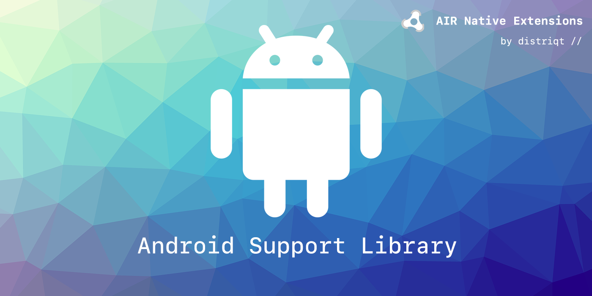

built by [distriqt //](https://airnativeextensions.com) 

# Android Support Libraries

This repository contains a range of Android library extensions that are to be used as dependencies for distriqt extensions. However they can be used with any ANEs and are just packages containing the relevant libraries to avoid conflicts between extensions.

## AndroidX 

Shared library AIR Native Extensions that include aspects of the AndroidX Support Library. 

> 
> AndroidX is a major improvement to the original Android Support Library, which is no longer maintained. androidx packages fully replace the Support Library by providing feature parity and new libraries.
>
> These libraries offer backward-compatible versions of new features, provide useful UI elements 
> that are not included in the framework, and provide a range of utilities that apps can draw on.
>

For information on migrating to AndroidX see the documentation in the individual extensions or the general guide [here](https://github.com/distriqt/ANE-AndroidSupport/blob/master/lib/README.md#migration).

>
> The Android Support extensions are deprecated and should not be used in new applications. (These are the extensions starting with `com.distriqt.androidsupport.`) The Android Support extensions have been left here for legacy applications and people requiring to support older applications.
>
> They may be removed in the near future.
>

## Android Libraries

This repository also contains some generic Google Android libraries including:

- GSON
- Dagger
- Data transport
- Install Referrer
- Material

These libraries are often used by Android SDKs and are packaged here for usage with the distriqt extensions. 

## Versions

The versions of the libraries is published in the [version documentation](https://github.com/distriqt/ANE-AndroidSupport/blob/master/lib/VERSION.md).

## Native Extensions

The highest quality and widest range of Native Extensions for Adobe AIR

With over 40 extensions available, we are the largest provider of native extensions for AIR developers. 
Our mobile solutions allow developers to fast-forward development and focus on building great games and apps.

https://airnativeextensions.com

